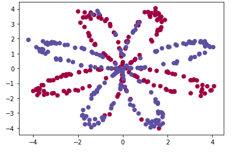
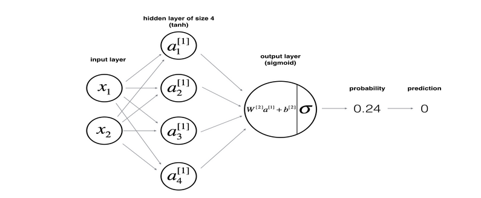
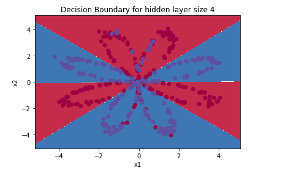
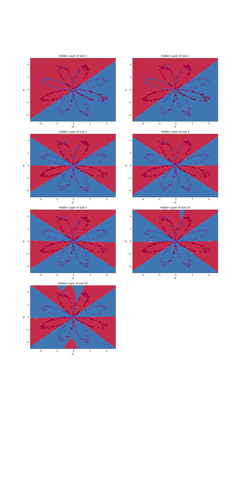

# Planar-data-classification
Implementation of two-layer neural network 
 

## Overview:

This repository contains implementation for Planar Data Classification using  Two-layer Neural Network on the given dataset for binary classification. It includes following steps:

- Loading necessary packages.
- Implementing utility functions to convert images to dataset.
- Implementing functions for sigmoid activation, forward propogation and backward propagation
- Implementing optimization and prediction functions.
- Training the model with training dataset.
- Testing the accuracy of model with test dataset.

# Details: 
The data looks like a "flower" with some red (label y=0) and some blue (y=1) points. The visulaization of the data is shown in figure:

The model of neural network for this planar data classification is shown below: 

This is the visualization of Gradient Descent algorithm used in Back-Propogation to update the model parameters and hence reduce the error in prediction.

 

After training the model with hidden layer of size 4, we get the decision boundary for data as follows:

However, we still can perform better by tuning the hidden layer size and plotting the results. Following is the summary of accuracies achieved for different number of hidden layer neuron units.

Accuracy for 1 hidden units: 67.5 %
Accuracy for 2 hidden units: 67.25 %
Accuracy for 3 hidden units: 90.75 %
Accuracy for 4 hidden units: 90.5 %
Accuracy for 5 hidden units: 91.25 %
Accuracy for 20 hidden units: 90.0 %
Accuracy for 50 hidden units: 90.25 % 

Below is the plot of results for each case.

## Dependencies:

To run this project, you need to have deep learning setup in your local machine.

## Windows:

Follow the instruction [here](http://inmachineswetrust.com/posts/deep-learning-setup/) to install conda on windows.

After following the above instructions, you need to install pillow and pytables into the conda deeplearning environment:
 - Make sure deeplearning environment is active:
   `activate deeplearning`
 - Then, run following commands: 
   
   `conda install pillow`
   
   `conda install pytables`

   `conda install h5py`

## Ubuntu

Follow the steps in this link [here](https://medium.com/@iamHarin17/how-to-setup-a-python-environment-for-deep-learning-with-anaconda-f65ab78a362) to setup a deep learing environment in Ubuntu .

## Instructions to run the project:

After setting up deep learning environment, follow these steps to run the .ipynb file that contains code for logistic regression.

-  `git clone https://github.com/nakul3112/Planar-data-classification.git`
-  Ubuntu: `conda activate <environment-name>`

     Windows: `activate <environment-name>`

     Replace the environment name above with the name of your deep learning environment.
-  Run jupyter notebook
     `jupyter notebook`
-  Navigate to the .ipynb file and run the kernel.

